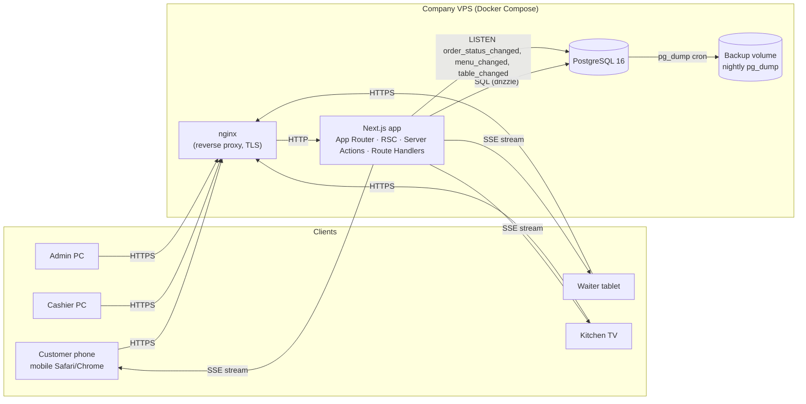
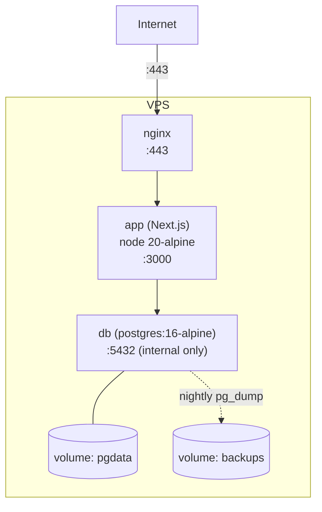
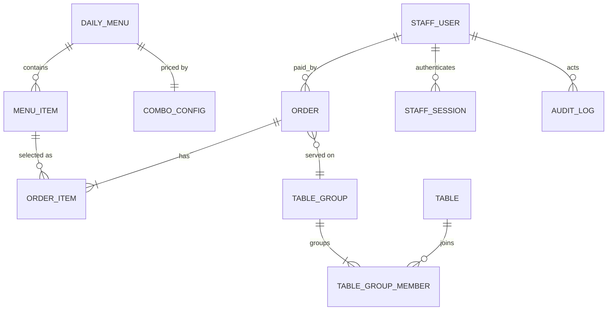
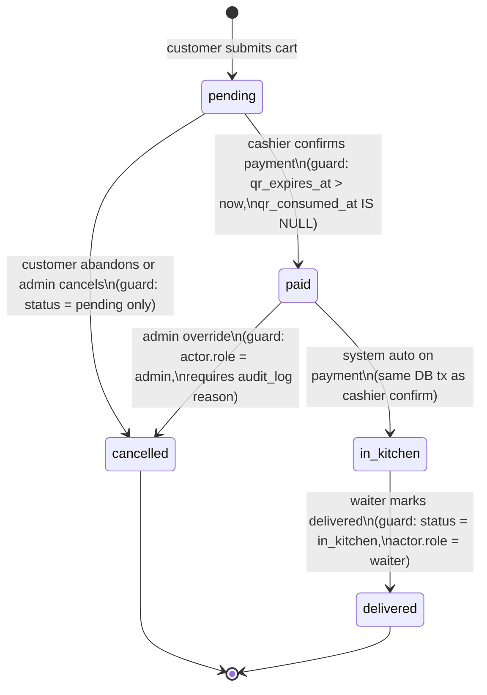

# Design: 001-mvp-foundation

**Status:** approved
**Created:** 2026-05-23
**Author:** system (openspec / sdd-design)
**Supersedes:** scaffold

---

## 1. Architecture overview

### 1.1 High-level diagram



Notes:

- Request types fall into three lanes: **reads** are React Server Components, **mutations** are Server Actions, **live streams** are Route Handlers exposing `text/event-stream`.
- Postgres acts as both the system of record and the realtime event bus (`LISTEN/NOTIFY`).
- nginx terminates TLS, gzips, and rate-limits before forwarding to the Next.js process.

### 1.2 Deployment topology



- `docker-compose.yml` defines three services: `nginx`, `app`, `db`.
- `docker-compose.dev.yml` overrides for local dev (no nginx, app runs `next dev`, port 3000 exposed directly).
- Only nginx publishes ports to the host; `app` and `db` communicate over the internal Docker network.

### 1.3 Why Next.js App Router

| Concern | App Router fit |
|---|---|
| Menu reads (RSC) | Daily menu and table layout are heavy reads, low write rate — server-render on each request, cache invalidated by `revalidateTag`. |
| Cashier confirm (Server Action) | Form-driven mutation with CSRF protection built in; transactional logic stays on the server. |
| SSE streams (Route Handlers) | App Router exposes raw `Request`/`Response`; ideal for `text/event-stream`. |
| Role-based layouts | Route groups `(customer)`, `(staff)/...` give per-role middleware and shared layouts without URL prefixes leaking. |
| Single binary | Same Next.js container handles HTML, API, and SSE — minimal infra surface for a single-VPS deployment. |

---

## 2. Tech stack decisions

| Area | Choice | Rationale | Rejected |
|---|---|---|---|
| ORM | **Drizzle ORM** | SQL-first, zero runtime overhead, full TS inference, easy SQL migrations to inspect. | Prisma — heavier query-engine binary, less ergonomic with serverless/edge, opaque query plans. |
| Realtime | **Postgres `LISTEN/NOTIFY` + Server-Sent Events** | Reuses existing PG connection, no extra broker, one-way server→client matches MVP needs. | WebSockets (Socket.io / Partykit) — bidirectional is overkill, requires sticky sessions or external broker. |
| Client state | **TanStack Query** for server cache + **Zustand** for ephemeral UI state (cart drawer, PIN entry) | Query handles SWR/revalidation and SSE-driven cache patching; Zustand keeps local state cheap. | Redux Toolkit — too much boilerplate for a small surface. |
| Styling | **Tailwind CSS + shadcn/ui** | Token-driven, mobile-first, accessible primitives copied into repo (no vendor lock-in). | CSS modules + custom components — too slow to ship MVP UI variety. |
| Forms & validation | **React Hook Form + Zod** | RHF for fast uncontrolled inputs; Zod schemas reused on server to validate Server Action inputs and Route Handler bodies. | Formik — slower with large forms; no shared schema story with backend. |
| Testing | **Vitest** (unit/component) + **Playwright** (E2E, chromium + webkit) + **`@testing-library/react`** | Vitest aligns with Vite-style speed; Playwright covers mobile-Safari-like behaviour via webkit. | Jest — slower in TS; Cypress — single-browser, no webkit. |
| Lint / format | **ESLint** (typescript-eslint, next, jsx-a11y) + **Prettier** + `eslint-plugin-import` sorting | Standard, enforceable in CI. | Biome — fast but ecosystem still catching up for Next.js rules. |
| Staff auth | **`argon2id`** PIN hash, **6-digit** PINs, rate-limit **5 attempts / 15 min** keyed by `(ip, role)`, session via signed cookie using **`iron-session`** | Argon2id resists GPU brute-force; 6 digits balances usability and security; iron-session avoids a session store. | bcrypt — older; pure JWT in cookie — harder to revoke. |
| QR / order token | **HS256 JWT**, 15-min TTL, payload `{ orderId, tableId, nonce, iat, exp }`, signed with `QR_SECRET` | Self-contained, stateless verify; nonce + DB `qr_token` column ensures single-use after payment. | Random short code only — replayable; HMAC-SHA256 raw — equivalent but JWT tooling is broader. |

---

## 3. Domain model (ERD)

### 3.1 Mermaid ER diagram



### 3.2 Table breakdown

> All timestamps are `timestamptz`. Money is stored as `int` cents. Primary keys are `bigserial` unless noted (orders use UUID v7).

**`daily_menu`**

| Column | Type | Notes |
|---|---|---|
| `id` | `bigserial` PK | |
| `service_date` | `date` UNIQUE NOT NULL | One row per calendar day |
| `opened_at` | `timestamptz` | When admin published it |
| `closed_at` | `timestamptz` NULL | When service ended |
| `notes` | `text` NULL | Admin freeform |

**`menu_item`**

| Column | Type | Notes |
|---|---|---|
| `id` | `bigserial` PK | |
| `daily_menu_id` | `bigint` FK → `daily_menu.id` ON DELETE CASCADE | |
| `category` | `enum('starter','main','drink','dessert')` NOT NULL | |
| `name` | `text` NOT NULL | Spanish copy |
| `description` | `text` NULL | |
| `is_available` | `boolean` NOT NULL DEFAULT true | Toggled live |
| `sort_order` | `int` NOT NULL DEFAULT 0 | |

Index: `menu_item(daily_menu_id, sort_order)`.

**`combo_config`**

| Column | Type | Notes |
|---|---|---|
| `id` | `bigserial` PK | |
| `daily_menu_id` | `bigint` UNIQUE FK → `daily_menu.id` | One row per day |
| `dine_in_price_cents` | `int` NOT NULL | Default 1300 |
| `takeaway_price_cents` | `int` NOT NULL | Default 1500 |
| `tupper_full_price_cents` | `int` NOT NULL | Default 200 |
| `tupper_partial_price_cents` | `int` NOT NULL | Default 100 |
| `partial_starter_price_cents` | `int` NOT NULL | Only-starter price |
| `partial_main_price_cents` | `int` NOT NULL | Only-main price |

**`table`** (quoted in SQL as `"table"`)

| Column | Type | Notes |
|---|---|---|
| `id` | `bigserial` PK | |
| `code` | `text` UNIQUE NOT NULL | e.g. `"M14"` |
| `capacity` | `int` NOT NULL | |
| `position_x` | `int` NOT NULL | Grid coords for layout |
| `position_y` | `int` NOT NULL | |
| `is_active` | `boolean` NOT NULL DEFAULT true | |

**`table_group`**

| Column | Type | Notes |
|---|---|---|
| `id` | `bigserial` PK | |
| `name` | `text` NULL | Admin label e.g. `"Familia 8 pax"` |
| `created_at` | `timestamptz` NOT NULL DEFAULT now() | |
| `closed_at` | `timestamptz` NULL | When group dissolved |

**`table_group_member`**

| Column | Type | Notes |
|---|---|---|
| `table_group_id` | `bigint` FK | composite PK |
| `table_id` | `bigint` FK | composite PK |

PK: `(table_group_id, table_id)`. A table can belong to at most one *open* group at a time (enforced by partial unique index `WHERE closed_at IS NULL`).

**`order`** (quoted as `"order"`)

| Column | Type | Notes |
|---|---|---|
| `id` | `uuid` PK | UUID v7 (time-sortable) |
| `short_code` | `text` UNIQUE NOT NULL | 4-char alphanum (e.g. `"A3F7"`) for cashier manual entry |
| `status` | `enum('pending','paid','in_kitchen','delivered','cancelled')` NOT NULL DEFAULT `'pending'` | |
| `order_type` | `enum('dine_in','takeaway')` NOT NULL | |
| `table_group_id` | `bigint` FK NULL | NULL for takeaway |
| `total_cents` | `int` NOT NULL | Computed by pricing engine, frozen at create |
| `qr_token` | `text` UNIQUE NOT NULL | Signed JWT |
| `qr_expires_at` | `timestamptz` NOT NULL | |
| `qr_consumed_at` | `timestamptz` NULL | Single-use flag |
| `created_at` | `timestamptz` NOT NULL DEFAULT now() | |
| `paid_at` | `timestamptz` NULL | |
| `paid_by_cashier_id` | `bigint` FK → `staff_user.id` NULL | |
| `payment_method` | `enum('cash','yape')` NULL | |
| `delivered_at` | `timestamptz` NULL | |
| `cancelled_at` | `timestamptz` NULL | |

Indexes: `order(short_code)`, `order(qr_token)`, `order(status, created_at)`.

**`order_item`**

| Column | Type | Notes |
|---|---|---|
| `id` | `bigserial` PK | |
| `order_id` | `uuid` FK → `order.id` ON DELETE CASCADE | |
| `menu_item_id` | `bigint` FK → `menu_item.id` | |
| `variant` | `enum('full_combo','only_starter','only_main','drink_extra','dessert_extra')` NOT NULL | |
| `with_tupper` | `boolean` NOT NULL DEFAULT false | |
| `quantity` | `int` NOT NULL CHECK (`quantity > 0`) | |
| `unit_price_cents` | `int` NOT NULL | Frozen at create |

**`staff_user`**

| Column | Type | Notes |
|---|---|---|
| `id` | `bigserial` PK | |
| `role` | `enum('cashier','waiter','admin')` NOT NULL | |
| `display_name` | `text` NOT NULL | |
| `pin_hash` | `text` NOT NULL | argon2id |
| `is_active` | `boolean` NOT NULL DEFAULT true | |
| `created_at` | `timestamptz` NOT NULL DEFAULT now() | |

**`staff_session`**

| Column | Type | Notes |
|---|---|---|
| `id` | `uuid` PK | |
| `staff_user_id` | `bigint` FK | |
| `expires_at` | `timestamptz` NOT NULL | Sliding 8 h |
| `last_seen_at` | `timestamptz` NOT NULL | |
| `user_agent` | `text` NULL | |

**`audit_log`**

| Column | Type | Notes |
|---|---|---|
| `id` | `bigserial` PK | |
| `actor_type` | `enum('staff','system')` NOT NULL | |
| `actor_id` | `bigint` NULL | |
| `action` | `text` NOT NULL | e.g. `'order.confirm_payment'` |
| `entity` | `text` NOT NULL | e.g. `'order'` |
| `entity_id` | `text` NOT NULL | UUID or bigint as text |
| `payload` | `jsonb` NOT NULL DEFAULT `'{}'` | |
| `created_at` | `timestamptz` NOT NULL DEFAULT now() | |

Index: `audit_log(entity, entity_id, created_at desc)`.

---

## 4. State machine — Order lifecycle



**Guards (enforced in `server/services/orders.ts` inside a single transaction):**

- `pending → paid`: `qr_expires_at > now()` AND `qr_consumed_at IS NULL` AND actor role is `cashier`. On success: set `paid_at`, `paid_by_cashier_id`, `payment_method`, `qr_consumed_at`.
- `paid → in_kitchen`: applied atomically with the cashier confirm; no separate user action. Modeled as one composite transition `pending → in_kitchen` in code, but the intermediate `paid` state is materialized for audit + reporting.
- `in_kitchen → delivered`: actor role is `waiter`. Sets `delivered_at`.
- `pending → cancelled`: only while still pending; no kitchen impact.
- `paid → cancelled`: admin only, must include `reason` in `audit_log.payload`.
- Any other transition rejected with `INVALID_TRANSITION`.

The status enum order is preserved so reports can sort by lifecycle position.

---

## 5. API surface

Annotations: `[RSC]` = React Server Component page, `[SA]` = Server Action, `[RH]` = Route Handler.

### 5.1 Customer (no auth, anonymous)

| Method/Path | Kind | Purpose |
|---|---|---|
| `GET /` | `[RSC]` | Landing page; renders today's published menu (cached, tag `daily-menu`). |
| `GET /pedido/[token]` | `[RSC]` | Order detail view (status, QR, items). Hydrates an SSE-backed client component. |
| `POST /api/orders` | `[RH]` | Create order draft. Body validated by Zod. Returns `{ orderId, shortCode, qrToken, qrExpiresAt, totalCents }`. Rate-limited 10/min per IP. |
| `GET /api/orders/:token` | `[RH]` | Poll order status (fallback for clients without SSE). |
| `GET /api/sse/order/:token` | `[RH]` | `text/event-stream` for one order. Events: `status`, `keepalive`. |

### 5.2 Cashier (PIN auth)

| Method/Path | Kind | Purpose |
|---|---|---|
| `GET /caja` | `[RSC]` | Checkout console; left panel scanner, right panel order summary. |
| `POST /caja/scan` | `[SA]` | Lookup by short code or scanned QR token. Returns order summary or `NOT_FOUND` / `EXPIRED`. |
| `POST /caja/confirm` | `[SA]` | Confirm payment. Body: `{ orderId, paymentMethod }`. Transitions order to `in_kitchen`, emits `NOTIFY order_status_changed`. |

### 5.3 Waiter (PIN auth)

| Method/Path | Kind | Purpose |
|---|---|---|
| `GET /mozo` | `[RSC]` | Active orders grouped by table. |
| `GET /api/sse/floor` | `[RH]` | SSE stream of active orders + table state. |
| `POST /mozo/deliver/:orderId` | `[SA]` | Mark `in_kitchen → delivered`. |

### 5.4 Kitchen (PIN auth, device-pinned via long-lived session)

| Method/Path | Kind | Purpose |
|---|---|---|
| `GET /cocina` | `[RSC]` | TV display; renders empty board hydrated by SSE. |
| `GET /api/sse/kitchen` | `[RH]` | SSE stream of paid + in-kitchen orders, sorted by `paid_at`. |

### 5.5 Admin (PIN auth)

| Method/Path | Kind | Purpose |
|---|---|---|
| `GET /admin/menu` | `[RSC]` | Today's menu CRUD. |
| `POST /admin/menu/items` | `[SA]` | Add or edit menu item. |
| `POST /admin/menu/items/:id/availability` | `[SA]` | Toggle `is_available`. Emits `NOTIFY menu_changed`. |
| `GET /admin/tables` | `[RSC]` | Table layout editor (basic in MVP). |
| `POST /admin/tables/group` | `[SA]` | Create / dissolve a `table_group`. Emits `NOTIFY table_changed`. |
| `GET /admin/reports/daily` | `[RSC]` | Daily sales summary. |

All Server Actions return a discriminated union `{ ok: true, data } | { ok: false, error: { code, message } }`. Route Handlers return JSON with appropriate HTTP codes (200/201/400/401/403/404/409/429/500).

---

## 6. Realtime architecture

### 6.1 Channels

| Channel | Payload (JSON in NOTIFY) | Emitted by |
|---|---|---|
| `menu_changed` | `{ dailyMenuId, itemId?, kind: 'availability'|'crud' }` | Admin actions on `menu_item` / `daily_menu`. |
| `order_status_changed` | `{ orderId, previousStatus, status, tableGroupId? }` | `confirm_payment`, `deliver`, `cancel`. |
| `table_changed` | `{ tableId?, tableGroupId?, kind: 'group_created'|'group_closed'|'activity' }` | Admin table-group ops; derived from order activity. |

### 6.2 Listener singleton

- One dedicated `pg` client (raw `node-postgres`, not Drizzle pool) executes `LISTEN menu_changed; LISTEN order_status_changed; LISTEN table_changed;` at process startup.
- The listener is exposed as `getRealtimeBus()` returning a typed `EventEmitter`. Stored on `globalThis` to survive Next.js hot reload in dev.
- Each SSE Route Handler subscribes to the relevant channel(s), filters by route param (e.g. order token → orderId), and writes events to the response stream.

### 6.3 SSE wire format

```
event: status
id: 1716480000123
data: {"orderId":"...","status":"in_kitchen","at":"2026-05-23T18:00:00Z"}

: keepalive
```

- Keepalive comment every **25 s** to prevent proxy idle timeouts.
- `id:` is the server monotonic timestamp so clients can pass `Last-Event-ID` on reconnect (server uses it to refetch missed transitions from `audit_log`).

### 6.4 Client reconnect

- TanStack Query is the source of truth for cached state; SSE handler calls `queryClient.setQueryData` on each event.
- Native `EventSource` handles reconnect; we wrap it with custom exponential backoff **1 s → 2 → 4 → 8 → 15 → 30 s (cap)** and a full `queryClient.invalidateQueries` on the first successful reconnect to backfill missed state.
- Visible `<OfflineBanner />` appears after 5 s of disconnection.

---

## 7. Component tree (high level)

### 7.1 Pages and shadcn/ui usage

| Page | shadcn primitives | Custom components |
|---|---|---|
| `(customer)/page.tsx` | `Card`, `Badge`, `Sheet`, `Button`, `Separator`, `Skeleton` | `MenuItemCard`, `OrderSummaryDrawer`, `OfflineBanner` |
| `(customer)/pedido/[token]/page.tsx` | `Card`, `Alert`, `Progress` | `OrderStatusTimeline`, `QrCodeDisplay` |
| `(staff)/caja/page.tsx` | `Tabs`, `Input`, `Dialog`, `RadioGroup`, `Button`, `Toast` | `QrScanner`, `OrderSummaryPanel`, `PinPad`, `RoleAuthGate` |
| `(staff)/mozo/page.tsx` | `Card`, `Badge`, `Tabs`, `Sheet` | `TableGrid`, `OrderRow`, `RoleAuthGate` |
| `(staff)/cocina/page.tsx` | `Card`, `Badge` | `KitchenTicket`, `KitchenBoard` |
| `(staff)/admin/menu/page.tsx` | `Table`, `Dialog`, `Switch`, `Form`, `Input` | `MenuItemEditor`, `RoleAuthGate` |
| `(staff)/admin/tables/page.tsx` | `Card`, `Dialog`, `Button` | `TableLayoutEditor` |
| `(staff)/admin/reports/daily/page.tsx` | `Table`, `Card` | `DailyReportSummary` |

### 7.2 Shared components

- **`MenuItemCard`** — customer-facing dish tile with availability state.
- **`OrderSummaryDrawer`** — slide-up cart with combo/partial selectors and tupper toggle.
- **`TableGrid`** — positional grid driven by `table.position_x/y` + group overlays.
- **`KitchenTicket`** — large-print ticket for TV display; grouped by table.
- **`RoleAuthGate`** — server component wrapper that 302s to `/auth/[role]` when no valid session.
- **`PinPad`** — 6-digit input with on-screen keypad for touch devices.
- **`OfflineBanner`** — sticky banner driven by SSE disconnect state.

---

## 8. Folder structure

```
src/
  app/
    (customer)/
      page.tsx
      pedido/[token]/page.tsx
    (staff)/
      caja/
        page.tsx
      mozo/
        page.tsx
      cocina/
        page.tsx
      admin/
        menu/page.tsx
        tables/page.tsx
        reports/daily/page.tsx
      auth/[role]/page.tsx
    api/
      health/route.ts
      orders/
        route.ts
        [token]/route.ts
      sse/
        order/[token]/route.ts
        floor/route.ts
        kitchen/route.ts
    layout.tsx
    globals.css
  components/
    ui/                        # shadcn primitives (generated)
    menu/MenuItemCard.tsx
    menu/OrderSummaryDrawer.tsx
    floor/TableGrid.tsx
    kitchen/KitchenTicket.tsx
    auth/RoleAuthGate.tsx
    auth/PinPad.tsx
    system/OfflineBanner.tsx
  db/
    schema.ts                  # drizzle schema (all tables)
    client.ts                  # drizzle + pg pool
    migrations/                # drizzle-kit output
  lib/
    auth/
      pin.ts                   # argon2id hash/verify
      session.ts               # iron-session config
      rateLimit.ts
    realtime/
      bus.ts                   # singleton LISTEN client + EventEmitter
      sse.ts                   # SSE helpers (writeEvent, keepalive)
    qr/
      token.ts                 # JWT sign/verify
      shortCode.ts             # base32 short code generator
    money/
      cents.ts                 # formatSoles, parseSoles
    validation/
      orderSchemas.ts          # Zod schemas shared client+server
  server/
    actions/
      cashier.ts
      waiter.ts
      admin.ts
    services/
      pricing.ts               # priceOrder pure fn
      orders.ts                # state transitions
      menu.ts
      tables.ts
docker/
  Dockerfile
  docker-compose.yml
  docker-compose.dev.yml
  nginx/
    nginx.conf
openspec/
  project.md
  config.yaml
  changes/
  specs/
tests/
  unit/
    pricing.test.ts
    state-machine.test.ts
    qr.test.ts
    pin.test.ts
  component/
    PinPad.test.tsx
    MenuItemCard.test.tsx
    OrderSummaryDrawer.test.tsx
  e2e/
    happy-path.spec.ts
    sold-out-realtime.spec.ts
    expired-qr.spec.ts
    cashier-cannot-release.spec.ts
```

---

## 9. Money handling

- All prices are stored as **integer cents** (`int`) in DB and TypeScript. Floats are forbidden in money paths.
- Single helper module `lib/money/cents.ts`:
  - `formatSoles(cents: number): string` → `"S/13.00"` (intl `es-PE`, `currency: 'PEN'`).
  - `sumCents(values: number[]): number` (named to discourage `reduce` ad-hoc).
- Pricing engine `server/services/pricing.ts` exports a pure function:

```ts
priceOrder(input: {
  items: { variant: OrderItemVariant; menuItemId: number; withTupper: boolean; quantity: number }[];
  orderType: 'dine_in' | 'takeaway';
  comboConfig: ComboConfigRow;
}): { totalCents: number; lines: { unitPriceCents: number; ... }[] }
```

Unit tests assert pricing against the matrix in `proposal.md §2`.

---

## 10. Security

- All `(staff)/*` routes pass through `middleware.ts` which:
  1. Reads the iron-session cookie.
  2. Rejects requests where `role` does not match the route group (e.g. waiter cannot reach `/admin`).
  3. Refreshes `staff_session.last_seen_at`.
- **CSRF:**
  - Server Actions: built-in Next.js token enforced.
  - Route Handlers (mutations): require `same-origin` and a custom header `X-Requested-With: rc-app`.
- **QR tokens:** signed JWT verified on every cashier scan; on successful payment we set `qr_consumed_at = now()` in the same transaction — replaying the same token is rejected as `ALREADY_CONSUMED`.
- **Rate limits:**
  - `POST /api/orders`: 10/min per IP (in-memory token bucket; per-process is acceptable for a single VPS).
  - PIN entry: 5 attempts / 15 min per `(ip, role)` pair; lockout returns generic error.
- **Headers** (set in `next.config.ts` and reinforced in nginx):
  - `Strict-Transport-Security: max-age=63072000; includeSubDomains`
  - `Content-Security-Policy` with `'self'` + inline-style nonce
  - `X-Content-Type-Options: nosniff`
  - `Referrer-Policy: same-origin`
  - `Permissions-Policy: camera=(self), microphone=()` (cashier scans QR via camera).
- Secrets (`SESSION_PASSWORD`, `QR_SECRET`, `POSTGRES_PASSWORD`) injected via Docker env file, never committed.

---

## 11. Observability

- **Logging:** `pino` with `pino-pretty` only in dev. Each request gets a `requestId` (ULID) attached via middleware; logs include `requestId`, `role`, `userId?`, `action`, `durationMs`.
- **Healthcheck:** `GET /api/health` returns `{ ok, db: 'up'|'down', listener: 'up'|'down', uptimeSec }`. nginx and a uptime monitor can poll it.
- **Audit log:** every cashier confirm, admin override, menu CRUD, and table-group change writes to `audit_log` with `payload` (e.g. `{ reason, totalCents }`).
- **Backups:**
  - Cron sidecar (or `db` container postStart hook) runs `pg_dump` daily at 03:00 local, writes timestamped gzipped dump to the `backups` volume.
  - Volume is bind-mounted to host so off-site sync (rsync / rclone to S3 or SFTP) can pick it up.
- **Metrics (minimal MVP):** a `/api/health` extension `/api/metrics` returns counters (orders created/paid/delivered today) for an external scrape if desired; full Prometheus is post-MVP.

---

## 12. Testing strategy

| Layer | Tooling | Coverage targets |
|---|---|---|
| Unit | Vitest | `priceOrder`, state-machine guards, JWT sign/verify, argon2 hash/verify, short-code generator. ≥ 90 % line coverage on `lib/` and `server/services/`. |
| Component | Vitest + Testing Library | `PinPad`, `MenuItemCard`, `OrderSummaryDrawer`. Interaction tests via `@testing-library/user-event`. |
| E2E | Playwright (chromium + webkit) | Scenarios below. |

**E2E scenarios (Playwright):**

1. **Happy path** — Customer builds an order on a phone viewport, receives QR, cashier scans and confirms cash payment, kitchen TV shows the ticket within 2 s, waiter marks delivered.
2. **Realtime sold-out** — Admin toggles `is_available = false` on the active main dish; an open customer tab updates the dish state within 2 s and prevents adding it to cart.
3. **Expired QR** — Order is created and time is fast-forwarded past `qr_expires_at`; cashier scan returns `EXPIRED`, status stays `pending`, order eventually auto-cancels.
4. **Payment gate** — Cashier opens an order but skips confirm; kitchen board never shows it; only after `confirm` does it appear. Direct `POST /mozo/deliver/:id` against a `pending` order returns `INVALID_TRANSITION`.

CI gates: lint, typecheck, unit + component (parallel), then E2E against a docker-compose stack with `app` and `db`.

---

## 13. Open questions — resolved vs deferred

**Resolved in this design:**

- **ORM** — Drizzle (locked).
- **Realtime** — Postgres `LISTEN/NOTIFY` + SSE (locked).
- **Migrations** — `drizzle-kit` generates SQL files committed to `src/db/migrations/`.
- **ID strategy** — UUID v7 for `order.id` (time-sortable, kitchen feed orders naturally), `bigserial` for everything else.
- **QR token** — HS256 JWT, 15-min TTL, single-use via `qr_consumed_at`.
- **Money type** — integer cents everywhere, no floats.
- **Staff auth** — argon2id PINs, iron-session cookie, role-based middleware.

**Deferred (out of this design, captured for later):**

- **Customer receipt printing** — thermal printer integration is post-MVP.
- **Detailed reports schema** — beyond daily totals; routed to `/sdd-spec admin-panel`.
- **Table layout editor UX** — drag-and-drop authoring is routed to `/sdd-spec table-management`. MVP ships a simple position editor only.
- **Multi-branch / multi-tenant** — explicitly out of MVP.
- **PWA / offline mode** — explicitly out of MVP.
